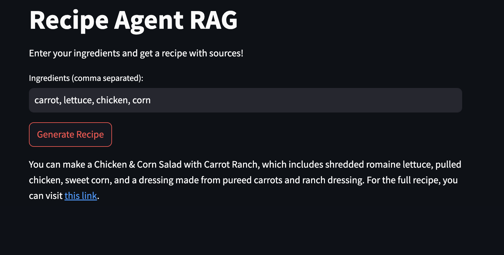

# Recipe Agent RAG 

This project implements a **Retrieval-Augmented Generation (RAG) agent** that creates recipes from user-provided ingredients using **LangChain, Tavily, and OpenAI**.

## Features
- User inputs ingredients
- Agent searches the web for recipes
- Generates a recipe with step-by-step instructions
- Cites sources for transparency
- Interactive Streamlit frontend
- FastAPI backend for API access

## **Live Demo (Streamlit)**
You can try the interactive demo here: [Streamlit UI](http://10.0.0.219:8501/)  

## Architectural workflow
User → Streamlit → FastAPI → LangChain RAG agent → Tavily → LLM → response
### Screenshot of Streamlit UI


## Installation
```bash
git clone https://github.com/ememusoh/recipe-rag-agent.git
cd recipe-rag-agent
python -m venv .venv
source .venv/bin/activate
pip install -r requirements.txt
