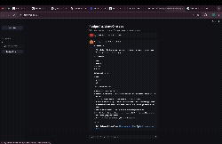
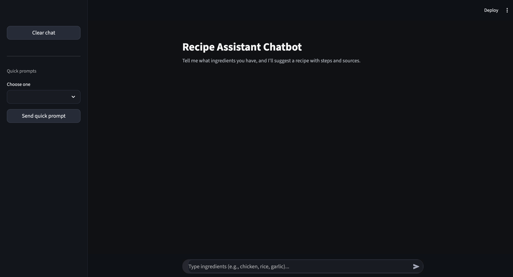
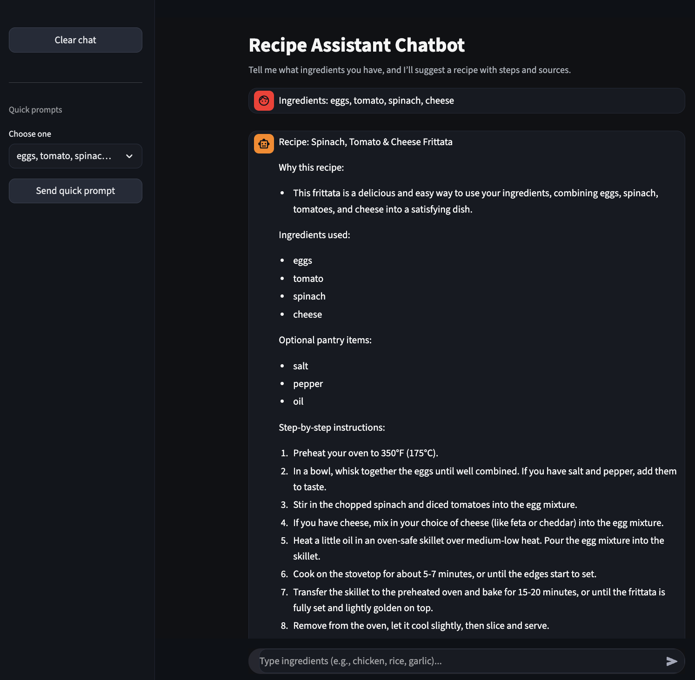

# Recipe Assistant Chatbot
<!--  -->


This project implements an **LLM-powered recipe assistant** that helps users decide what to cook using ingredients they already have at home. The app takes user-provided ingredients, searches the web for relevant recipe ideas using **Tavily Search**, and returns **one recommended recipe** with **step-by-step cooking instructions** and **source links**.

The project uses a **Streamlit frontend** for user interaction and a **FastAPI backend** to handle the recipe-generation workflow.

## Features

- Accepts user-provided ingredients (e.g., "rice, chicken, garlic, onion")
- Searches the web for matching recipe ideas using Tavily
- Uses a LangChain agent with OpenAI to select **one suitable recipe**
- Returns a structured recipe response with:
  - recipe name
  - reason for recommendation
  - ingredients used
  - optional pantry items
  - step-by-step cooking instructions
  - source link(s)
- Streamlit UI for interactive use
- FastAPI backend endpoint for API access

## Tech Stack

- **Python**
- **LangChain**
- **OpenAI (GPT-4o-mini)**
- **Tavily Search**
- **FastAPI**
- **Streamlit**

## Project Architecture

User → Streamlit UI → FastAPI API → LangChain Agent → Tavily Search → OpenAI LLM → Response

## Screenshots

### Streamlit UI



## Project Structure

```bash
recipe-rag-agent/
├── app/
│   ├── agent_setup.py      # LangChain agent + Tavily tool setup
│   └── main.py             # FastAPI app (/generate_recipe)
├── streamlit_app.py        # Streamlit frontend (if named differently, update this)
├── requirements.txt
└── README.md

git clone https://github.com/ememusoh/recipe-rag-agent.git
cd recipe-rag-agent
python -m venv .venv
source .venv/bin/activate
pip install -r requirements.txt